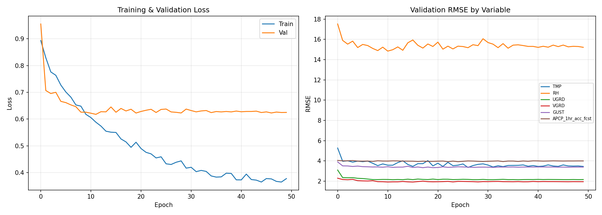

# Train 1 Report: CNN Baseline v1

## 1. Experiment Overview

| Item | Detail |
|------|--------|
| Run name | `cnn_baseline_1` |
| Model class | `BaselineCNN` (`models/cnn_baseline.py`) |
| SLURM Job | 315256 |
| GPU | NVIDIA L40S (pax023) |
| Date | 2026-03-15 |
| Status | Completed (50/50 epochs) |
| Total time | ~14.4 hours (~1040s/epoch) |
| Trainable parameters | 11,325,062 |

---

## 2. Architecture (Reproducible Specification)

### 2.1 Overview

单帧 2D CNN，输入一张气象空间快照，经 6 层 ResBlock 逐步降采样后全局平均池化，最后由全连接层回归 6 个目标变量。架构为自定义设计（assignment 允许自由选择架构）。

```
Input (B, 42, 450, 449)
    |
    +-- Stem -----------------------------------------------------------------
    |    Conv2d(42, 64, kernel=7x7, stride=2, padding=3, bias=False)
    |    BatchNorm2d(64)
    |    ReLU(inplace=True)
    |    Output: (B, 64, 225, 225)
    |
    +-- Layer1: ResBlock(64 -> 64, stride=1)   -> (B, 64, 225, 225)
    +-- Layer2: ResBlock(64 -> 128, stride=2)  -> (B, 128, 113, 113)
    +-- Layer3: ResBlock(128 -> 256, stride=2) -> (B, 256, 57, 57)
    +-- Layer4: ResBlock(256 -> 256, stride=2) -> (B, 256, 29, 29)
    +-- Layer5: ResBlock(256 -> 512, stride=2) -> (B, 512, 15, 15)
    +-- Layer6: ResBlock(512 -> 512, stride=2) -> (B, 512, 8, 8)
    |
    +-- AdaptiveAvgPool2d(1) ------------------> (B, 512, 1, 1)
    |
    +-- Head -----------------------------------------------------------------
         Flatten                              -> (B, 512)
         Linear(512, 128)
         ReLU(inplace=True)
         Dropout(p=0.3)
         Linear(128, 6)                       -> (B, 6)
```

### 2.2 ResBlock Detail

每个 ResBlock 包含 2 个 3x3 卷积 + BatchNorm，以及一条 skip connection：

```
Input x (in_ch, H, W)
    |
    +-- Main path:
    |    Conv2d(in_ch, out_ch, 3x3, stride=stride, padding=1, bias=False)
    |    BatchNorm2d(out_ch)
    |    ReLU(inplace=True)
    |    Conv2d(out_ch, out_ch, 3x3, stride=1, padding=1, bias=False)
    |    BatchNorm2d(out_ch)
    |
    +-- Shortcut:
    |    if stride != 1 or in_ch != out_ch:
    |        Conv2d(in_ch, out_ch, 1x1, stride=stride, bias=False)
    |        BatchNorm2d(out_ch)
    |    else:
    |        Identity()
    |
    +-- Output = ReLU(main + shortcut)
```

### 2.3 Channel Progression

| Stage | Input Ch | Output Ch | Spatial Size | Stride | Parameters (approx) |
|-------|---------|----------|-------------|--------|-------------------|
| Stem | 42 | 64 | 225x225 | 2 | 42x64x7x7 = 131,712 |
| Layer1 | 64 | 64 | 225x225 | 1 | 2x(64x64x3x3) = 73,728 |
| Layer2 | 64 | 128 | 113x113 | 2 | ~221K |
| Layer3 | 128 | 256 | 57x57 | 2 | ~885K |
| Layer4 | 256 | 256 | 29x29 | 1 | ~1.18M |
| Layer5 | 256 | 512 | 15x15 | 2 | ~3.54M |
| Layer6 | 512 | 512 | 8x8 | 1 | ~4.72M |
| Head | 512 | 6 | - | - | 512x128 + 128x6 = 66,438 |
| **Total** | | | | | **11,325,062** |

### 2.4 Design Choices

| Choice | Value | Rationale |
|--------|-------|-----------|
| base_channels | 64 | ResNet-style 起始宽度 |
| Stem kernel | 7x7, stride 2 | 快速降低空间分辨率，减少后续计算量 |
| ResBlock kernel | 3x3 | 标准 ResNet 设计 |
| 所有 Conv bias | False | 配合 BatchNorm 使用，bias 冗余 |
| 激活函数 | ReLU(inplace) | 节省显存 |
| Pooling | AdaptiveAvgPool2d(1) | 全局平均池化，不依赖输入尺寸 |
| Head | 2 层 FC (512->128->6) | 轻量回归头 |
| 分类头 | 无 | AUC 直接用 APCP 预测值排序 |

---

## 3. Optimization Configuration

### 3.1 Optimizer

| Param | Value |
|-------|-------|
| Optimizer | **AdamW** (`torch.optim.AdamW`) |
| Learning rate | 1e-3 |
| Weight decay | 1e-4 |
| Betas | (0.9, 0.999) (PyTorch default) |
| Epsilon | 1e-8 (PyTorch default) |

### 3.2 Learning Rate Schedule

| Param | Value |
|-------|-------|
| Scheduler | **CosineAnnealingLR** |
| T_max | 50 (= total epochs) |
| eta_min | 0 (default) |
| Warmup | None |

LR trajectory: `lr(t) = 0.5 * lr_init * (1 + cos(pi * t / T_max))`

### 3.3 Loss Function

```python
criterion = nn.MSELoss()
```

- 对 6 个标准化后的目标变量统一计算 MSE，无 per-variable 加权
- 无独立分类 loss（AUC 通过 APCP 预测值的大小做 ranking score 计算，不参与训练）

### 3.4 Gradient Clipping

```python
torch.nn.utils.clip_grad_norm_(model.parameters(), max_norm=1.0)
```

---

## 4. Regularization

### 4.1 Current Methods

| Method | Location | Config |
|--------|----------|--------|
| **Weight decay** | 全部参数 (AdamW) | 1e-4 |
| **Dropout** | FC head (Linear(512,128) 之后) | p=0.3 |
| **BatchNorm** | 每个 Conv 之后 | 共 13 个 BN 层 |
| **Gradient clipping** | 全局 | max_norm=1.0 (数值稳定性，非严格正则化) |

### 4.2 Coverage Analysis

| Component | Parameters | % of Total | Dropout Coverage |
|-----------|-----------|------------|-----------------|
| 卷积层 (Stem + 6 ResBlocks) | ~11.26M | 99.4% | None |
| FC Head | ~66K | 0.6% | Dropout(0.3) |

**问题**: 99.4% 的参数（卷积层）仅靠 weight decay (1e-4) 和 BN 的轻微正则效果。对 11.3M 参数 / ~20K 样本 (~565:1 参数/样本比) 而言不足以防止过拟合。

### 4.3 Not Used

Data augmentation, Spatial dropout / DropBlock, Label smoothing, Stochastic depth, Early stopping, Mixup / CutMix

---

## 5. Data Pipeline

### 5.1 Dataset

| Item | Value |
|------|-------|
| 数据来源 | HRRR (High-Resolution Rapid Refresh) 气象再分析 |
| 空间范围 | 新英格兰地区, Lambert Conformal 投影, 3km 网格 |
| 空间尺寸 | 450 x 449 格点 |
| 通道数 | 42 个大气变量 |
| 时间覆盖 | 3 年逐小时数据 (~26,280 小时) |
| 每样本大小 | `(450, 449, 42)` bfloat16 -> float32 |
| 预测目标 | Jumbo Statue 网格点, t+24h, 6 个变量 + 1 个二元标签 |

### 5.2 Data Split

| Split | Years | Samples (approx) | Batches |
|-------|-------|----------|---------|
| Train | 2018, 2019 | ~12,888 (1611 x 8) | 1611 |
| Validation | 2020 | ~8,784 (1098 x 8) | 1098 |
| Test | 2021 | TBD | 未运行 |

### 5.3 Normalization

- **Method**: Per-channel z-score
- **Computation**: 从训练集随机采样 1000 个样本，计算每通道的空间均值/标准差
- **Input**: `x_norm = (x - mean) / (std + 1e-7)`, mean/std shape `(42, 1, 1)`
- **Target**: `y_norm = (y - mean) / (std + 1e-7)`, mean/std shape `(6,)`
- **Persistence**: 保存为 `norm_stats.pt`; 推理时从 checkpoint 加载

### 5.4 NaN Handling

| Stage | Method |
|-------|--------|
| Dataset `__getitem__` | 含 NaN 的帧返回 None |
| DataLoader collate | `collate_skip_none` 过滤 None 样本 |
| Training loop | `torch.isnan(loss)` 时跳过 batch |
| Validation RMSE | 逐变量过滤 NaN (~2% 样本) |

### 5.5 DataLoader Config

| Param | Train | Val |
|-------|-------|-----|
| batch_size | 8 | 8 |
| shuffle | True | False |
| drop_last | True | False |
| num_workers | 2 | 2 |
| pin_memory | True | True |
| prefetch_factor | 2 | 2 |

---

## 6. Training Process

### 6.1 Per-Epoch Loop

```
for epoch in range(50):
    1. train_one_epoch():
       - model.train()
       - for batch in train_loader (1611 batches):
           - forward -> MSELoss -> NaN check -> backward -> clip_grad -> step
           - print every 200 batches
    2. validate():
       - model.eval() + no_grad()
       - collect all preds/targets/binary
       - compute val_loss (MSE)
    3. compute_metrics():
       - denormalize preds & targets
       - per-variable RMSE (filter NaN per variable)
       - conditional APCP RMSE (true > 2mm only)
       - AUC via roc_auc_score
    4. scheduler.step() (cosine)
    5. save latest.pt; if val_loss improved: save best.pt
    6. log CSV + update training_curves.png
```

### 6.2 Earlier Failed Runs

| Job | GPU | Issue |
|-----|-----|-------|
| 312194 | H200 | 手动取消 (首次调试) |
| 312214 | A100 | OOM killed |
| 312227 | H200 | NaN crash in `roc_auc_score` (后修复: 加 NaN 过滤) |
| 312336 | A100 | SLURM 超时 24h, 跑了 27/30 epochs; RMSE 全 nan (后修复: denorm bug) |

---

## 7. Results

### 7.1 Best Validation (Epoch 11) -- best.pt

| Variable | RMSE | Unit |
|----------|------|------|
| TMP@2m | 3.577 | K |
| RH@2m | 14.978 | % |
| UGRD@10m | 2.148 | m/s |
| VGRD@10m | 1.935 | m/s |
| GUST@surface | 3.368 | m/s |
| APCP_1hr (cond.) | 4.007 | mm |
| **AUC (rain)** | **0.679** | - |
| **Val Loss** | **0.6177** | - |

### 7.2 Final Epoch (Epoch 49) -- latest.pt (not synced locally)

| Variable | RMSE | Unit |
|----------|------|------|
| TMP@2m | 3.455 | K |
| RH@2m | 15.214 | % |
| UGRD@10m | 2.162 | m/s |
| VGRD@10m | 1.951 | m/s |
| GUST@surface | 3.394 | m/s |
| APCP_1hr (cond.) | 4.000 | mm |
| **AUC (rain)** | **0.647** | - |
| **Val Loss** | **0.6249** | - |

### 7.3 Best Per-Variable Across All Epochs

| Variable | Best RMSE | Epoch |
|----------|-----------|-------|
| TMP@2m | 3.358 | 26 |
| RH@2m | 14.839 | 10 |
| UGRD@10m | 2.146 | 30 |
| VGRD@10m | 1.917 | 15 |
| GUST@surface | 3.335 | 17 |
| APCP_1hr (cond.) | 3.926 | 22 |
| AUC (rain) | 0.745 | 7 |

### 7.4 Training Curves



**Left (Loss)**: train 0.89->0.37, val 0.96->0.62 (epoch 11 后停滞), 过拟合明显。
**Right (RMSE)**: RH ~15 主导; TMP ~3.5; 风速 ~2-3.4; APCP ~4.0; epoch 8-10 后全部收敛。

---

## 8. Assessment

### 8.1 Assignment Requirements (Part 1)

| # | Requirement | Status |
|---|------------|--------|
| 1 | 接受 `(450, 449, c)` 输入 | PASS |
| 2 | 预测 6 个目标变量 | PASS |
| 3 | Held-out test set 评估 | **PENDING** |
| 4 | 架构和训练过程说明 | PASS |

### 8.2 Validation Results Assessment

| Variable | Best Val RMSE | Assessment |
|----------|--------------|-----------|
| TMP@2m | 3.577 K | 中等偏高 (好的 24h 预报 ~2-3K) |
| RH@2m | 14.978 % | 较差 (0-100% 范围, 偏差大) |
| UGRD@10m | 2.148 m/s | 尚可 (风速预报固有难度大) |
| VGRD@10m | 1.935 m/s | 尚可 |
| GUST@surface | 3.368 m/s | 中等 (阵风波动大) |
| APCP (cond.) | 4.007 mm | 较差 (强降水预报不准) |
| AUC | 0.679 | 较差 (<0.7, 弱分类) |

### 8.3 Key Issues

1. **过拟合**: 参数/样本比 ~565:1, 卷积层无 dropout, weight decay 偏弱
2. **AUC 退化**: 0.745 (epoch 7) -> ~0.65 (epoch 49), 无独立分类 loss
3. **Loss 不均衡**: 统一 MSELoss, RH 梯度可能主导
4. **NaN batches**: 每 epoch 2-8 个 batch 因数据 NaN 被跳过

---

## 9. Baseline Comparison (TODO)

需在 HPC 上运行 `evaluation/evaluate.py`，获取 persistence baseline (stub) 和 CNN baseline 在 test set (2021) 上的对比数据。

---

## 10. Reproduction

### 10.1 Command

```bash
# On HPC (Tufts Pax cluster)
module load class/default
module load cs137/2026spring

cd /cluster/tufts/c26sp1cs0137/pliu07/assignment2
sbatch scripts/train.slurm  # or:
python train.py --model cnn_baseline --epochs 50 --batch_size 8 --lr 0.001 \
    --weight_decay 0.0001 --scheduler cosine --base_channels 64 --num_workers 2
```

### 10.2 Key Files

| File | Description |
|------|-------------|
| `models/cnn_baseline.py` | Model definition (BaselineCNN, ResBlock) |
| `train.py` | Training script |
| `data_preparation/dataset.py` | WeatherDataset, DataLoader, normalization |
| `runs/cnn_baseline_1/config.json` | Exact hyperparameters used |
| `runs/cnn_baseline_1/checkpoints/best.pt` | Best model (epoch 11, val_loss=0.6177) |

---

## 11. Next Steps (for baseline_2)

1. **减少参数量**: base_channels 64->32, 或减少 ResBlock 层数 (6->4)
2. **增强正则化**: 卷积层加 Dropout/DropBlock; weight decay 增至 1e-3
3. **Early stopping**: patience-based, 避免无效训练
4. **Loss 改进**: per-variable loss 加权; 添加 BCE loss for rain classification
5. **Data augmentation**: 水平翻转 / 随机裁剪
6. **独立分类头**: sigmoid 输出 + BCE loss for rain/no-rain
